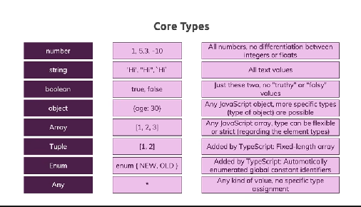

# type script

## core types:
1. number: contains all type of numbers, integer, float,...
2. string: contains the text between "", '', ``.
3. boolean: true or false.
4. object
5. array
6. tuple
7. enum
8. any

## watch node:
to avoid for each change in the file, we have to save the file then run `tsc filename.ts`

so to avoid it we type in the terminal `tsc filename.ts -w` but still for specific file no the entire project for all project:
1. `npx tsc --init`
2. it will create a (tsconfig.json) file
3. type in the terminal just `npx tsc`
4. type in the terminal just `npx tsc -w` or `npx tsc --watch`

